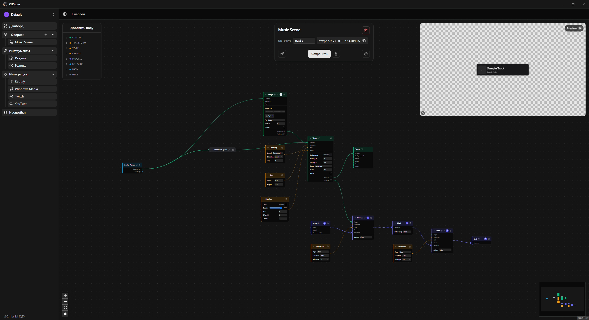
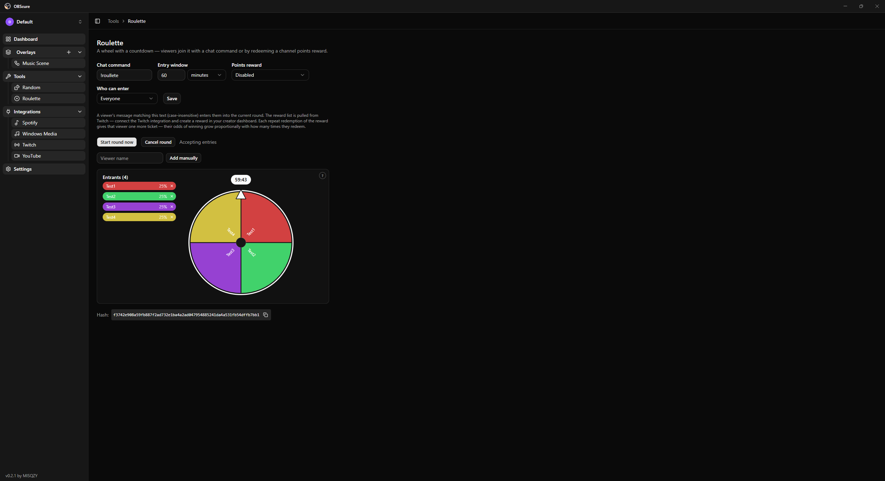
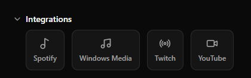
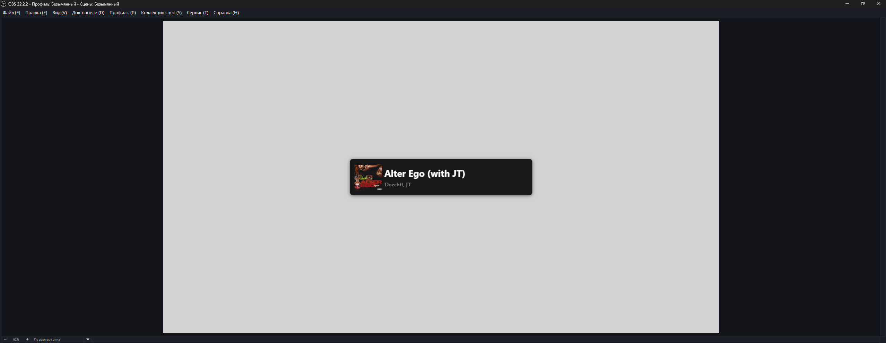

  
  
  <h1>OBScure</h1>
  
A powerful and user-friendly control panel for streamers: interactive overlays, widgets, and integrations for OBS Studio.

---

**OBScure** is a desktop application designed specifically for streamers. It allows you to easily create, customize, and manage interactive overlays, viewer mini-games, and widgets right during your broadcast. No more complex setups or dozens of open tabs: Twitch, YouTube, Spotify, and custom visual effects are now united in one convenient and stylish interface.

## Key Features

### Visual Overlay Editor
Create complex logic chains, reactions, and animations without writing a single line of code. The built-in node editor allows you to configure events using a highly visual "Trigger -> Condition -> Action" approach.

### Viewer Interactivity
Engage your audience with built-in mini-games and tools:
- **Roulette** — a mini-game for viewers in chat.
- **Random** — a quick selection or dice roll tool for your stream.

### Platform Integrations
OBScure brings all your essential services into a single window:
- **Twitch**: Read chat, follower alerts, channel statistics, and Channel Points rewards processing.
- **YouTube**: Live chat, new subscriber alerts, and Super Chats.
- **Music (Spotify & Windows Media)**: "Now Playing" widget displaying the track name and album art. Supports both Spotify and direct capture from any local media players and browsers (Windows only).

### Security & Autonomy
- **Local Storage**: All authorization tokens (OAuth) are securely encrypted and stored exclusively on your local machine.
- **Single Source for OBS**: The application acts as a local server. You just need to add a single Browser Source in OBS, and OBScure manages all the content on the fly.

## Installation & Quick Start

1. Download the latest version of OBScure from the [Releases](../../releases) section on GitHub.
2. Run the installer and follow the standard instructions.
3. Open the app and go to settings to link your desired accounts (Twitch, YouTube, Spotify).
4. Create your first overlay in the visual editor.
5. Copy the local link from OBScure and add it to your OBS Studio scene as a **Browser Source**.

## Support & Feedback

If you have any questions, found a bug, or have a cool idea for a new feature — feel free to open an Issue in this repository!

---

  <i>Made with ❤️ for the streaming community.</i>

